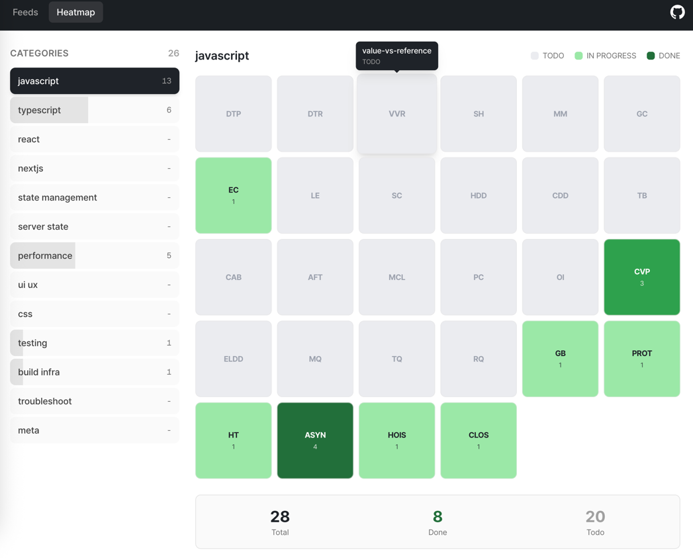

# 스킬 매트릭스 설계, 정적 구조 정의

오늘은 “내 기술 스킬을 한눈에 파악 가능하게 만드는 구조”를 어떻게 설계할지에 대해 고민을 해본 하루였다.    
단순 정리 수준을 넘어서, **내가 어떤 영역에서 강하고 약한지 스스로 추적**할 수 있는 체계를 만드는 게 목표였다.

이 과정에서 핵심은 **카테고리-토픽-스코어 구조를 어떻게 일반화하고, 새로운 토픽이 생겨도 시스템이 깨지지 않도록 만들 것인가**였다.  
본 목적은 타인이 보았을 때는 내게 어떤 강점이 존재하는지,  
내가 보았을 때에는 어떤 부분을 보완해야 할지가 한 눈에 들어와야 한다.  
그래야 의미있게 시간을 사용할 수 있지 않을까..

## 요약

- 스킬을 ‘기초 → 응용 → 실무 적용’ 단위까지 구조화하는 기준을 도출했다.
- frontmatter 기반 TIL 파일들의 패턴을 분석해, 그 스키마를 그대로 스킬 매트릭스 설계에 적용하기로 했다.
- Next.js에서 동적 카테고리/토픽을 자동 반영하는 방식으로 구성하기 위해 타입 구조 설계 방향을 잡았다.
- Heatmap 컴포넌트는 카테고리-토픽-스코어를 기반으로 생성하며, 확장 가능성을 우선으로 둔다.
- ‘새 토픽이 생겼을 때 어떻게 반영되는가’라는 구조적 문제에 대한 해답을 정리했다.

# 본론

## 1) 스킬 매트릭스의 근본적 목적 정의

정리 자체가 목적이 아니다.  
오늘 내린 결론은 “스킬 매트릭스는 **비교와 방향성**을 제공해야 한다”는 점이다.

즉,

- **남이 봤을 때** → 내가 어떤 분야의 강점/전문성을 갖는지 바로 보일 것
- **내가 봤을 때** → 어떤 영역이 비어 있고, 어디를 채워야 하는지 명확할 것

이 두 가지가 충족되지 않으면 그건 단순한 목록일 뿐, 매트릭스가 아니다.

그래서 구조를 “열거”보다 “계층화 + 정량화” 쪽으로 재정비했다.

## 2) 스킬 구조를 어떻게 계층화할 것인가?

### 기존 TIL frontmatter의 구조를 그대로 활용한다

업로드한 TIL 파일들의 공통 포맷은 아래와 같다:

- domain
- category
- topic

이걸 스킬 매트릭스에도 그대로 가져간다.

예시 구조:
```
Frontend
└── JavaScript
└── Closure
└── Execution Context
└── Hoisting
└── TypeScript
└── React
```

이미 네 TIL 파일들이 이 구조로 정리돼 있으니, **스킬 매트릭스는 그 데이터를 그대로 가져와서 확장하는 형태가 가장 깔끔하다.**

## 3) 각 토픽은 단순히 “이해?”로 끝나는 것이 아니라, 3단계로 구분한다

오늘 논의의 핵심 포인트.

### 스킬 평가는 아래 3축으로 나눈다:

1) **기초 이해 (Basic)**
2) **개념 깊이 (Depth)**
3) **실전 적용 (Practical)**

예시:

| topic              | basic | depth | practical |
|-------------------|-------|--------|------------|
| Closure           | 3     | 4      | 2          |
| Hoisting          | 4     | 3      | 3          |
| Exec Context      | 5     | 5      | 3          |

이렇게 구성해야 히트맵도 자연스럽고, 스스로 진척을 “정량적으로” 볼 수 있다.

## 4) 토픽이 추가될 때 자동으로 반영되도록 설계

> “스키마는 기본일 뿐이고, 새로운 카테고리나 토픽이 생기면 동적으로 반영되었으면 좋겠다.”

이 문제의 정답은 명확하다.

### **frontmatter 기반 TIL 파일들을 자동 스캔해 스키마를 구성한다.**

흐름은 다음과 같다:

1) 모든 `*.md` 파일 읽기
2) YAML frontmatter 파싱
3) domain/category/topic 추출
4) 트리 구조 및 스킬 매트릭스 데이터 자동 생성
5) Heatmap UI는 이 결과를 그대로 렌더링

이렇게 하면 “정적인 카테고리 정의”가 필요 없고,  
새로운 TIL 파일을 올리는 것만으로 스킬 매트릭스가 확장된다.

## 5) Heatmap 컴포넌트 구성 전략

### 데이터 타입 정의  
  
아마 앞으로 계속 추가 되겠지만, 우선 기본적인 정적인 형태를 구조화 해보려 한다.  
뭐든지 끈기 있게 하는 게 제일 중요하지 않을까 싶다.  
이게 시작이자 끝인듯한 느낌적인 느낌..!

```ts
export const baseCategories = [
  'javascript',
  'typescript',
  'react',
  'nextjs',
  'state-management',
  'server-state',
  'performance',
  'ui-ux',
  'css',
  'testing',
  'build-infra',
  'troubleshoot',
  'meta',
] as const;

export type BaseCategory = (typeof baseCategories)[number];

export const baseTopics: Record<string, string[]> = {
  javascript: [
    // 기본기 & 메모리
    'data-types-primitive', // number, string, boolean, null, undefined, symbol, bigint
    'data-types-reference', // object, array, function, map, set 등
    'value-vs-reference', // 값/참조, 얕은/깊은 복사
    'stack-heap', // 콜스택 vs 힙
    'memory-management', // 메모리 관리 개념
    'garbage-collection', // GC, reachability

    // 실행 컨텍스트 & 렉시컬 환경
    'execution-context', // 전역/함수/모듈 컨텍스트
    'lexical-environment', // environment record, OER
    'scope-chain',
    'hoisting-deep-dive',
    'callstack-deep-dive',

    // this & 컨텍스트
    'this-binding',
    'call-apply-bind',
    'arrow-function-this',
    'method-context-loss',

    // 프로토타입 & 객체 모델
    'prototype-chain',
    'object-internals',
    'class-vs-prototype',

    // 비동기 & 런타임
    'event-loop-deep-dive',
    'microtask-queue',
    'task-queue',
    'render-queue',
  ],

  typescript: [
    // 기본 타입 & 리터럴
    'ts-primitive-types',
    'literal-types',
    'widening-narrowing',
    'any-vs-unknown',

    // 타입 시스템 원리
    'structural-typing',
    'type-narrowing',
    'control-flow-analysis',
    'excess-property-checks',

    // 제네릭 & 고급 타입
    'generics-deep-dive',
    'generic-constraints',
    'conditional-types',
    'infer-keyword',
    'distributive-conditional',
    'mapped-types-deep-dive',

    // tsconfig & 컴파일
    'tsconfig-strict-mode',
    'module-resolution',
    'declaration-files',
  ],

  react: [
    'component-lifecycle',
    'hooks',
    'memoization',
    'context',
    'error-boundary',
    'suspense',
    'hydration',
    'key-mechanism',
    'controlled',
    'uncontrolled',
  ],

  nextjs: [
    'ssg',
    'ssr',
    'server-components',
    'client-components',
    'streaming',
    'routing',
    'middleware',
    'edge-runtime',
    'fetch-caching',
    'hydration-mismatch',
  ],

  'state-management': [
    'store-architecture',
    'selector-pattern',
    'atomic-state',
    'derived-state',
    'side-effects',
    'immutable-pattern',
    'global-vs-local-store',
    'performance-issue',
  ],

  'server-state': [
    'staleTime',
    'cacheTime',
    'queryKey',
    'hydration',
    'optimistic-update',
    'infinite-query',
    'mutation-flow',
    'retry-backoff',
    'prefetching',
    'initialData',
  ],

  performance: [
    'rerender-causes',
    'memoization',
    'code-splitting',
    'lazy-loading',
    'throttle',
    'debounce',
    'concurrent-feature',
    'profiling',
    'expensive-op',
    'web-vitals',
  ],

  'ui-ux': [
    'design-tokens',
    'accessibility',
    'semantic-html',
    'feedback-pattern',
    'skeleton',
    'layout-composition',
    'form-patterns',
    'input-handling',
    'list-virtualization',
  ],

  css: [
    'flex',
    'grid',
    'responsive',
    'typography',
    'custom-utilities',
    'pseudo-element',
    'variants',
    'animations',
    'theming',
    'spacing-scale',
  ],

  testing: [
    'unit-test',
    'integration-test',
    'e2e-test',
    'mocking',
    'snapshot-test',
    'test-pyramid',
    'msw',
    'regression-test',
  ],

  'build-infra': [
    'bundler',
    'tree-shaking',
    'code-splitting-build',
    'build-optimization',
    'ci',
    'caching',
    'static-assets',
    'environment-config',
  ],

  troubleshoot: [],

  meta: [],
};

```

## MVP! 
> 카테고리 X 토픽 기준으로 매트릭스 구성 완료!


