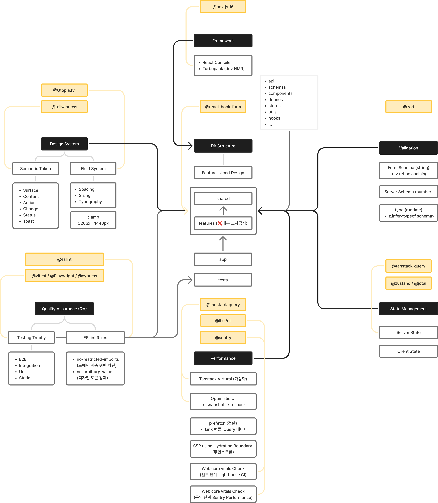

# Frontend Architecture

아키텍처에 대해 깊이 고민하고 시작한 프로젝트가 거의 없었다.  
당장 만들어서 당장 서빙하는게 주요한 과제였다.  
여유가 생긴김에 프론트엔드 아키텍처에 대해 고민해본 기록을 남겨보려 한다.  

## 모니터링을 제외한 주요 요소

우선 크게 7가지로 분류해봤다.  
물론 좋은 아키텍쳐 방법론들이 많겠지만, 실무에서 직접적으로 내가 그릴 수 있는 수준은 위와 같을거라 생각한다.  

> 1) Design System
> 2) Quality Assurance
> 3) Performance
> 4) Directory Structure
> 5) Framework
> 6) Validation
> 7) State Management

아마 추가로, monitoring이 있겠지만, 이건 제외했다.  
프로젝트 초반에 필요한 건 빌드 타임의 안정성과 런타임의 안정성, 그리고 유지보수성이다.  
Sentry를 좀 다뤄봐야하는데, 이건 별도 기록으로 남겨둬야 겠다.  

### 1) Design System

디자인 시스템은 시멘틱 토큰과 유동적인 시스템으로 분류 하였다.  

#### 시멘틱 토큰

tailwindcss를 쓰다보면, 자연스럽게 기본적으로 정의된 형태를 쓰기 마련이다.  
하지만 기획자나 디자이너가 원하는 요구사항을 최소한의 변경으로 구현하기 위해서는 맥락 단위의 시멘틱 토큰이 필수이다.  

#### 유동적인 시스템

디자인 시스템이 고정되어 있다면, 반응형을 구현하기는 쉽지 않을거라 생각한다.  
물론 device의 width에 따라 제각각 구분되는 형태를 구현해도 되지만, 매끄러운 사용자 경험을 위해서는 유동적인 시스템이 필요하다.  
Google 디자인 가이드와 MDN 문서를 읽어보면 최신 트랜드는 320px - 1440px 정도의 보간 값이 필요하다.  
우아하게 CSS의 clamp를 이용하면 이 구간내에 선형보간 되는 여백과 간격, 레이아웃, 폰트의 자간 등을 선형적으로 구현할 수 있게 된다.  

### 2) Quality Assurance

#### 린트

#### 테스트
